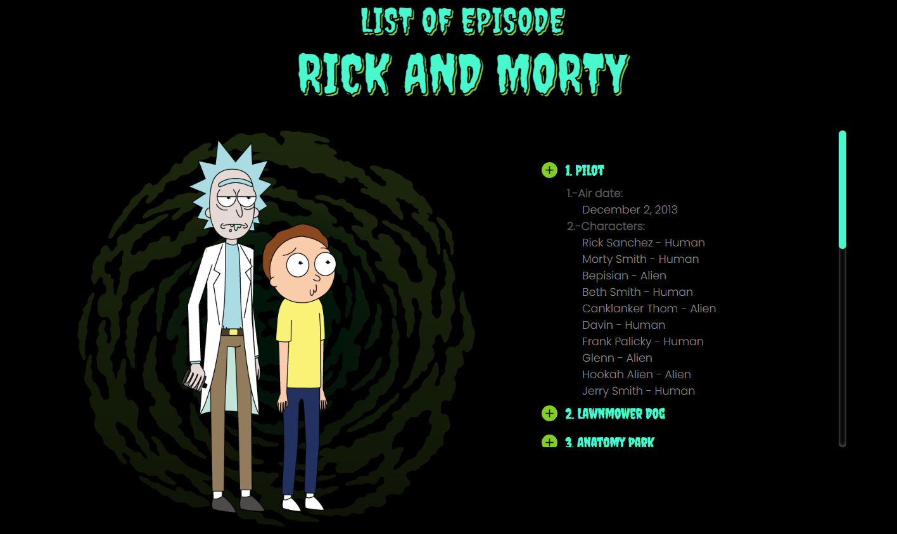
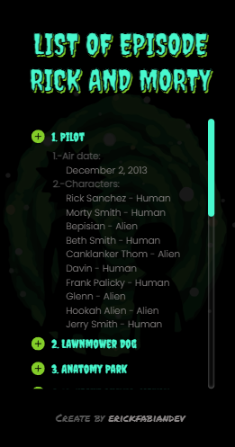
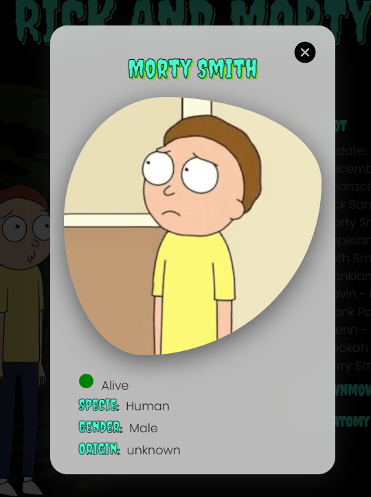

# Parallel Requests Project - RICKANDMORTY API 🚀  
## Table of contents :page_facing_up:
- [Overview](#overview)
  - [Installation](#Installation)  
  - [The challenge](#the-challenge)
  - [Screenshot](#screenshot)
- [My process](#my-process)
  - [Built with](#built-with)
  - [What I learned](#what-i-learned)
  - [Continued development](#continued-development)
  - [Useful resources](#useful-resources)
- [Authors](#authors)

## Overview :writing_hand:
This project is a high-quality web application that makes API requests using axios and utilizes the Promise.all parallelism principle for efficient data retrieval. The application presents a list of episodes with a polished and responsive user interface built with React, styled using SASS, and adorned with delightful icons from React Icons. Its adaptive design ensures an optimal viewing experience across various devices.
Link desing FIGMA : [Desing URL](https://www.figma.com/file/w5ffJ1CRo7j3jbJvnwqS94/Eposide-Ricky-and-Morty?type=design&node-id=0%3A1&mode=design&t=oIbPBzf43Z2vsLzb-1)

### Installation :gear:
To get started with the project, follow these steps:

1. Clone the repository:
```shell
git clone https://github.com/erickfabiandev/rickmorty-listofepisode.git
  ```
2. Navigate to the project directory:
```shell
cd rickmorty-listofepisode
 ```
3. To ensure the proper functioning of the application, you need to configure environment variables. Duplicate the .env.example file in the root directory, rename it to .env, and fill in the required API details:
```shell
 VITE_APIVITE_API_BASE_URL= 'https://rickandmortyapi.com/api'
  ```
4. Install the dependencies: 
```shell
 npm install
 ```
5. Start the application: 
```shell
 npm run dev
  ```
The application will automatically open in your default web browser, ready for exploration.

### The Challenge :weight_lifting_man:
The challenge was to create a web application that could get data from an API using the Promise.all parallelism principle in combination with axios and display a list of episodes. It required implementing custom styles with SASS and adding support for icons using React Icons. In addition, the application had to be fully responsive and adapt to different screen sizes.

### Screenshot 📷 
Here is a screenshot of the project's interface:

***desktop view***


***mobile view***



***Functionality : Select a character from the list and show detailed information**




## My Process :mountain:

During this project, I gained valuable insights in the following areas:

* Leveraging the Promise.all parallelism principle in combination with axios to optimize API requests.
* The implementation of modular and scalable styles with SASS, ensuring the maintainability and readability of the code.
* Using React Icons to enhance the UI with a variety of lovely icons.
* Creating a responsive design for a seamless experience on different devices.

### Built With :hammer_and_wrench:
The project was built using the following technologies:

* React
* Sass
* API
* Figma
* Axios

### What I Learned :microscope:
During this project, I gained valuable insights into the following areas:

* Leveraging the Promise.all parallelism principle with axios for optimizing API requests.
* Implementing modular and scalable styles with SASS, ensuring maintainability and readability.
* Utilizing React Icons to enhance the user interface with a variety of delightful icons.
* Creating a responsive design for a seamless experience across different devices.

### Continued Development :briefcase:
As the project evolves, potential future enhancements include:

* Implementing pagination to manage large datasets and improve performance.
* Enhancing the user interface with search and filtering options for enhanced user interaction

### Useful Resources :sos:
During the development of this project, the following resources were helpful:

* Official React documentation: https://reactjs.org/docs
* Official Sass documentation: https://sass-lang.com/documentation
* Axios documentation: https://axios-http.com/docs/intro
* React Icons: https://react-icons.github.io/react-icons/

## Author :nerd_face:

This project created by erickfabiandev.
- [erickfabiandev](https:erickfabiandev.com)
